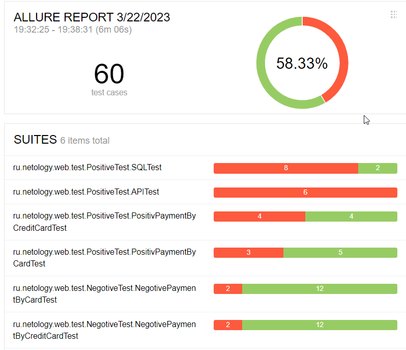
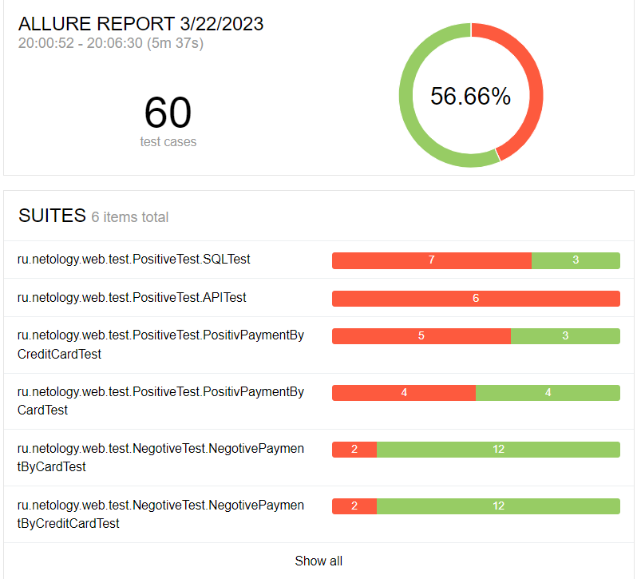

# Отчёт о проведенном тестировании.

## Краткое описание.

Произведена втоматизация тестирования комплексного сервиса, взаимодействующего с СУБД и API Банка.

## Количество тест-кейсов.

Всего было протестировано:

- на базе СУБД MySQL - 60 тест- кейсов.
  Из них успешных - 58,33% (35) тест-кейсов и неуспешных - 41,67% (25) тест-кейсов

- на базе СУБД PostgreSQL - 60 тест-кейсов. 
  Из них успешных - 56,66% (34) тест-кейсо и неуспешных - 43,34% (26) тест-кейсов

## Общие рекомендации.

По итогам тестирования были созданы Issuas, все баг-репорты нужно принять в работу.