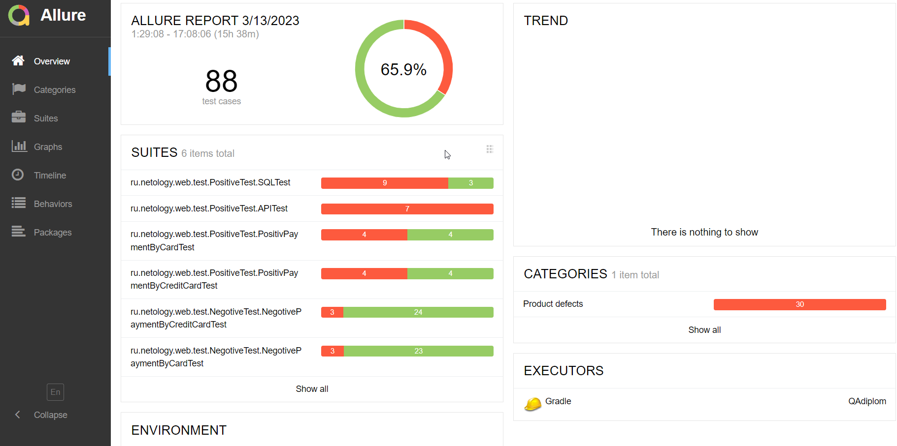
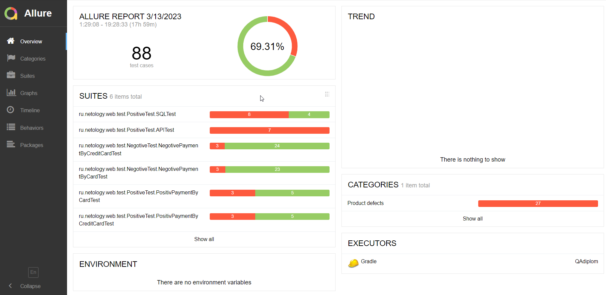

# Отчёт о проведенном тестировании.

## Краткое описание.

Произведена втоматизация тестирования комплексного сервиса, взаимодействующего с СУБД и API Банка.

## Количество тест-кейсов.

Всего было протестировано:

- на базе СУБД MySQL - 88 тест- кейсов.
  Из них успешных - 65,9% (58) тест-кейсов и неуспешных - 34,1% (30) тест-кейсов

- на базе СУБД PostgreSQL - 88 тест-кейсов. 
  Из них успешных - 69,31% (61) тест-кейсо и неуспешных - 30,69% (27) тест-кейсов

## Общие рекомендации.

По итогам тестирования были созданы Issuas, все баг-репорты нужно принять в работу.